# Voice ↔ Text Interface Context Synchronization

## Problem Statement

The **Voice Interface** (Gemini Live API) and **Text Interface** (Gemini Text API) maintain **separate conversation histories**:

| Interface | History Location | Shared with Other? |
|-----------|-----------------|-------------------|
| Voice | Server-side Live session | ❌ |
| Text | `textInterface.chatHistory[]` | ❌ |
| UI | `transcripts` state in App.tsx | ✅ (display only) |

When switching between interfaces, the newly-activated interface has **no knowledge** of what happened in the other.

---

## Design: Smart Context Synchronization

### Core Concept: **Watermark Tracking**

Track the **last synchronized message index** for each interface. On mode switch, inject only the **delta** (new messages since last sync).

```typescript
interface SyncState {
  lastVoiceSyncIndex: number;   // Last transcript index voice API knows about
  lastTextSyncIndex: number;    // Last transcript index text API knows about
}
```

---

## Scenario Diagrams

### Scenario 1: Text First, Then Voice

User chats via text, then starts a voice session.


---

### Scenario 2: Voice First, Then Text

User starts with voice, then switches to text.

```mermaid
sequenceDiagram
    participant U as User
    participant UI as App.tsx
    participant V as VoiceInterface
    participant T as TextInterface
    participant TR as transcripts[]

    Note over TR: lastTextSync=0, lastVoiceSync=0

    U->>UI: Clicks Voice button
    UI->>TR: Add marker "🎤 Voice ON" [idx=1]
    UI->>V: start()
    Note over TR: lastVoiceSync=1

    U->>V: Speaks "Create a note"
    V->>TR: Add user msg [idx=2]
    V-->>TR: Add tool call [idx=3]
    V-->>TR: Add model response [idx=4]

    rect rgb(255, 230, 200, 0.1)
        Note over U,T: User types message (stops voice)
        UI->>V: stop()
        UI->>TR: Add marker "⌨️ Text ON" [idx=5]
        UI->>UI: Compute delta [idx=0..5]
        UI->>T: injectHistory(delta as Content[])
        Note over T: Text now knows voice history
        Note over TR: lastTextSync=5
    end

    UI->>T: sendMessage("Edit that note")
    T->>TR: Add user msg [idx=6]
    T-->>TR: Add model response [idx=7]
```



---

### Scenario 3: Text Input During Active Voice

User types while voice session is running (no mode switch).


---

### Scenario 4: Rapid Mode Switching

User switches modes multiple times.


---

### Watermark Logic Summary


---

## Implementation Details

### 1. New State in App.tsx

```typescript
// Watermarks for context sync
const [lastVoiceSyncIndex, setLastVoiceSyncIndex] = useState<number>(0);
const [lastTextSyncIndex, setLastTextSyncIndex] = useState<number>(0);

// Refs for use in callbacks
const lastVoiceSyncIndexRef = useRef<number>(0);
const lastTextSyncIndexRef = useRef<number>(0);
```

### 2. System Markers (Visual History Boundaries)

Add visible markers in `transcripts` when switching modes:

```typescript
const addModeMarker = (mode: 'voice' | 'text') => {
  const marker: TranscriptionEntry = {
    id: `mode-${Date.now()}`,
    role: 'system',
    text: mode === 'voice' 
      ? '🎤 Voice interface activated' 
      : '⌨️ Text interface activated',
    isComplete: true,
    timestamp: Date.now(),
    topicId: currentTopicIdRef.current,
    toolData: {
      name: 'mode_switch',
      filename: '',
      status: 'success'
    }
  };
  setTranscripts(prev => [...prev, marker]);
};
```

### 3. Delta Computation

```typescript
const computeDelta = (fromIndex: number): TranscriptionEntry[] => {
  return transcriptsRef.current.slice(fromIndex).filter(t => 
    t.role !== 'system' || // Include user/model messages
    t.toolData?.name === 'mode_switch' // Include mode switches for context
  );
};

const formatDeltaForInjection = (delta: TranscriptionEntry[]): string => {
  if (delta.length === 0) return '';
  
  const lines = delta.map(t => {
    const role = t.role === 'user' ? 'User' : t.role === 'model' ? 'Assistant' : 'System';
    return `[${role}]: ${t.text}`;
  });
  
  return `--- CONVERSATION CONTEXT (${delta.length} messages) ---\n${lines.join('\n')}\n--- END CONTEXT ---`;
};
```

### 4. Voice Session Start (with sync)

```typescript
const startSession = async () => {
  // ... existing validation ...
  
  // Add mode marker
  addModeMarker('voice');
  
  // Compute delta since last voice sync
  const delta = computeDelta(lastVoiceSyncIndexRef.current);
  
  // Create and start voice session
  assistantRef.current = new GeminiVoiceAssistant(assistantCallbacks);
  await assistantRef.current.start(activeKey, settings, initialState);
  
  // Inject context if there's a delta
  if (delta.length > 0) {
    const contextMessage = formatDeltaForInjection(delta);
    // Small delay to ensure session is ready
    setTimeout(() => {
      assistantRef.current?.sendText(contextMessage);
    }, 500);
  }
  
  // Update watermark
  setLastVoiceSyncIndex(transcriptsRef.current.length);
  lastVoiceSyncIndexRef.current = transcriptsRef.current.length;
};
```

### 5. Text Interface Sync (before sending)

Add method to `GeminiTextInterface`:

```typescript
// In textInterface.ts
injectHistory(entries: Content[]): void {
  this.chatHistory.push(...entries);
}

// Convert TranscriptionEntry[] to Content[]
transcriptsToContents(transcripts: TranscriptionEntry[]): Content[] {
  return transcripts
    .filter(t => t.role === 'user' || t.role === 'model')
    .map(t => ({
      role: t.role as 'user' | 'model',
      parts: [{ text: t.text }]
    }));
}
```

In `handleSendText`:

```typescript
const handleSendText = async (e: React.FormEvent) => {
  e.preventDefault();
  if (!inputText.trim()) return;
  
  const message = inputText.trim();
  setInputText('');
  
  // Stop voice if active
  if (status === ConnectionStatus.CONNECTED && assistantRef.current) {
    assistantRef.current.stop();
    assistantRef.current = null;
    addModeMarker('text');
  }
  
  // ... initialize text interface if needed ...
  
  // Sync delta to text interface
  const delta = computeDelta(lastTextSyncIndexRef.current);
  if (delta.length > 0 && textInterfaceRef.current) {
    const contents = transcriptsToContents(delta);
    textInterfaceRef.current.injectHistory(contents);
  }
  
  // Update watermark
  setLastTextSyncIndex(transcriptsRef.current.length);
  lastTextSyncIndexRef.current = transcriptsRef.current.length;
  
  // Send message
  textInterfaceRef.current.sendMessage(message);
};
```

### 6. Text Input During Active Voice Session

When voice is active and user types, route to voice:

```typescript
const handleSendText = async (e: React.FormEvent) => {
  e.preventDefault();
  if (!inputText.trim()) return;
  
  const message = inputText.trim();
  setInputText('');
  
  // If voice is active, inject text into voice session (no mode switch)
  if (status === ConnectionStatus.CONNECTED && assistantRef.current) {
    assistantRef.current.sendText(message);
    // Manually add to transcripts since voice won't echo it back as user input
    setTranscripts(prev => [...prev, {
      id: `typed-${Date.now()}`,
      role: 'user',
      text: message,
      isComplete: true,
      timestamp: Date.now(),
      topicId: currentTopicIdRef.current
    }]);
    return; // Don't use text interface
  }
  
  // ... rest of text interface logic ...
};
```

---

## Context Injection Strategies

### Strategy A: Full Delta (Default)
Inject all messages since last sync. Good for short conversations.

### Strategy B: Summarized Delta
If delta > N messages (e.g., 20), use LLM to summarize before injection:

```typescript
const injectWithSummary = async (delta: TranscriptionEntry[]) => {
  if (delta.length <= 20) {
    return formatDeltaForInjection(delta);
  }
  
  // Summarize older messages, keep recent ones verbatim
  const older = delta.slice(0, -5);
  const recent = delta.slice(-5);
  
  const summary = await textInterfaceRef.current?.generateSummary(
    `Summarize this conversation in 2-3 sentences:\n${formatDeltaForInjection(older)}`
  );
  
  return `--- CONVERSATION SUMMARY ---\n${summary}\n--- RECENT MESSAGES ---\n${formatDeltaForInjection(recent)}`;
};
```

### Strategy C: Sliding Window
Only inject last N messages regardless of sync state. Simpler but loses older context.

---

## Edge Cases

| Scenario | Handling |
|----------|----------|
| Voice starts with empty history | No injection needed |
| Text starts with empty history | No injection needed |
| Rapid mode switching | Debounce mode markers (skip if < 2s apart) |
| Voice session fails to start | Don't update watermark |
| Text interface not initialized | Initialize before sync |
| Tool calls in delta | Include tool name + result summary |

---

## Files to Modify

1. **`App.tsx`**
   - Add `lastVoiceSyncIndex`, `lastTextSyncIndex` state + refs
   - Add `addModeMarker()` helper
   - Add `computeDelta()`, `formatDeltaForInjection()` helpers
   - Modify `startSession()` to inject context
   - Modify `handleSendText()` to:
     - Route to voice if active
     - Sync delta before text API call

2. **`services/textInterface.ts`**
   - Add `injectHistory(entries: Content[])` method

3. **`types.ts`**
   - Add `mode_switch` to ToolData name options (optional, for typing)

4. **`components/TranscriptMessage.tsx`** (if exists)
   - Style mode switch markers distinctly

---

## Visual Markers in UI

Mode switch markers should be visually distinct:

```css
/* In styles-input.css */
.hermes-mode-marker {
  display: flex;
  align-items: center;
  justify-content: center;
  padding: 4px 12px;
  margin: 8px 0;
  font-size: 11px;
  color: var(--hermes-text-muted);
  border-top: 1px dashed var(--hermes-border);
  border-bottom: 1px dashed var(--hermes-border);
}
```

Example render:
```
─────── 🎤 Voice interface activated ───────
```

---

## Token Budget Considerations

| Interface | Context Limit | Strategy |
|-----------|--------------|----------|
| Voice (Live API) | ~128K tokens | Inject as text, counts against limit |
| Text (Flash) | ~1M tokens | More headroom, can inject more |

For voice, prefer **Strategy B** (summarized) if delta is large.

---

## Testing Checklist

- [ ] Text → Voice: Voice knows about text conversation
- [ ] Voice → Text: Text knows about voice conversation  
- [ ] Text during Voice: Message goes to voice session
- [ ] Rapid switching: No duplicate markers
- [ ] Empty history: No injection, no errors
- [ ] Large delta: Summarization kicks in
- [ ] Mode markers visible in UI
- [ ] Watermarks persist correctly
