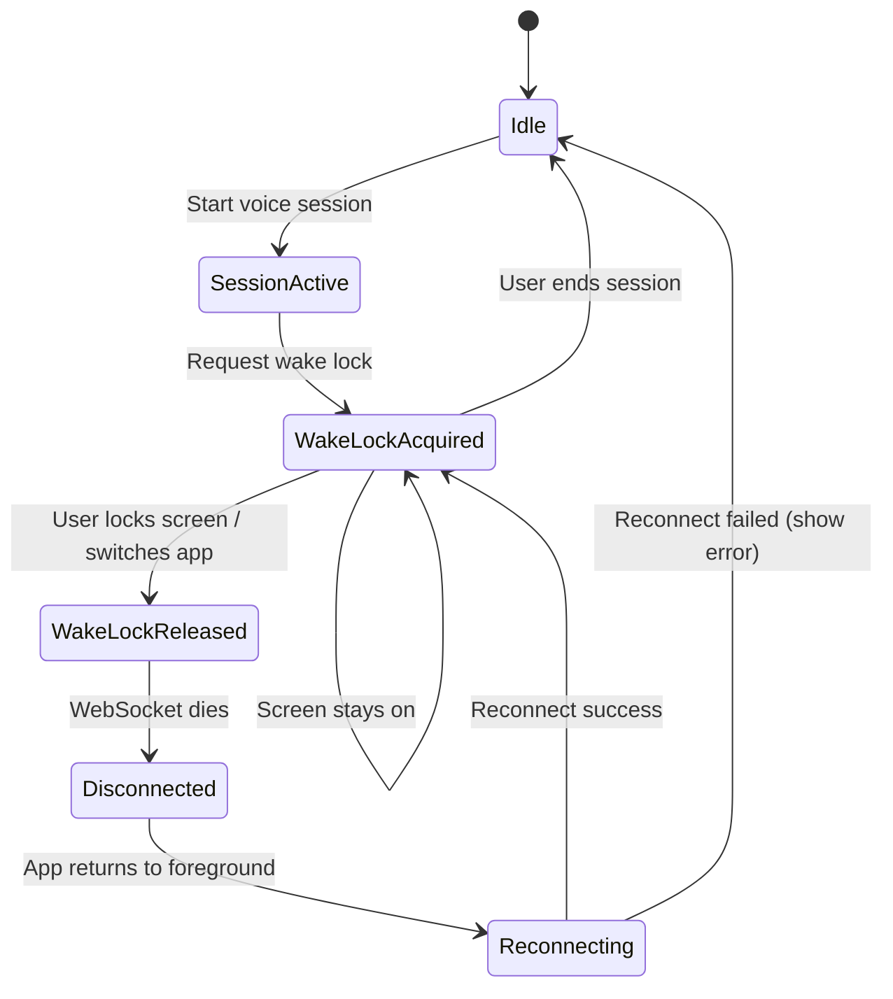

# Mobile Session Persistence Solution

## Problem Statement

When using Hermes voice assistant on mobile (Obsidian iOS/Android), the session ends abruptly when:
- User presses the lock button
- User switches to another app
- Screen times out (auto-sleep)

The OS aggressively suspends the webview, killing WebSocket connections. This is an OS-level limitation that cannot be fully bypassed by plugins.

### Why This Happens

Obsidian mobile runs on Capacitor (webview wrapper). When the app goes to background:
- **iOS**: Webview suspended, WebSocket connections drop
- **Android**: Same + aggressive battery optimization from vendors

**Foreground services are NOT available** to Obsidian plugins. This is a hard limitation.

---

## Solution Overview

We implement a **best-effort persistence strategy** combining:
1. Screen Wake Lock API (prevents auto-sleep)
2. Silent audio keep-alive (extends background time)
3. Graceful reconnection (handles inevitable disconnects)
4. Clear UI feedback (user knows what's happening)



---

## Implementation Details

### 1. Screen Wake Lock API

**Purpose**: Prevent screen from auto-sleeping during active voice session.

**Location**: `services/wakeLock.ts` (new file)

```typescript
let wakeLock: WakeLockSentinel | null = null;
let wakeLockSupported = 'wakeLock' in navigator;

export async function requestWakeLock(): Promise<boolean> {
  if (!wakeLockSupported) {
    console.warn('Wake Lock API not supported');
    return false;
  }
  
  try {
    wakeLock = await navigator.wakeLock.request('screen');
    
    wakeLock.addEventListener('release', () => {
      console.log('Wake Lock released');
      // Notify UI - this fires when user locks screen or switches app
    });
    
    return true;
  } catch (err) {
    console.error('Wake Lock request failed:', err);
    return false;
  }
}

export function releaseWakeLock(): void {
  if (wakeLock) {
    wakeLock.release();
    wakeLock = null;
  }
}

export function isWakeLockActive(): boolean {
  return wakeLock !== null && !wakeLock.released;
}
```

**UI Feedback Required**:
- Show toast: "Screen will stay on during voice session" when acquired
- Show system message in chat: "🔒 Screen lock enabled"
- Show toast: "Screen lock released" when released (user locked/switched)

### 2. Release Wake Lock on Error/End

**Trigger points**:
- `voiceInterface.stop()` - user ends session
- WebSocket `onerror` event
- WebSocket `onclose` event
- `topic_switch` tool call (conversation archived)

```typescript
// In voiceInterface.ts stop() function
export async function stop() {
  // ... existing cleanup ...
  
  // Release wake lock
  releaseWakeLock();
  
  // Stop silent audio
  stopSilentAudio();
}

// In WebSocket error handler
ws.onerror = (error) => {
  releaseWakeLock();
  stopSilentAudio();
  // ... existing error handling ...
};

ws.onclose = () => {
  releaseWakeLock();
  stopSilentAudio();
  // ... existing close handling ...
};
```

### 3. Lock Button Detection

**Can we detect it?** Not directly, but we can infer it.

**What happens when user presses lock button:**
1. `visibilitychange` event fires → `document.visibilityState === 'hidden'`
2. `WakeLockSentinel` fires `release` event
3. WebSocket connection dies (within seconds)

**Detection pattern**:
```typescript
let sessionWasActive = false;

// Track when wake lock is released during active session
wakeLock.addEventListener('release', () => {
  if (sessionWasActive) {
    // User locked screen or switched apps during voice session
    // Mark for reconnection attempt when they return
    pendingReconnect = true;
  }
});

document.addEventListener('visibilitychange', async () => {
  if (document.visibilityState === 'visible' && pendingReconnect) {
    // User came back - attempt reconnect
    await attemptReconnect();
  }
});
```

**Important**: We CANNOT prevent the user from locking the screen. Wake Lock only prevents auto-sleep.

### 4. Auto-Reconnect on Connection Drop

**Location**: `services/voiceInterface.ts`

```typescript
let reconnectAttempts = 0;
const MAX_RECONNECT_ATTEMPTS = 3;
const RECONNECT_DELAY_MS = 1000;

async function attemptReconnect(): Promise<boolean> {
  if (reconnectAttempts >= MAX_RECONNECT_ATTEMPTS) {
    // Show error: "Could not reconnect. Please start a new session."
    return false;
  }
  
  reconnectAttempts++;
  
  // Show UI: "Reconnecting... (attempt X/3)"
  
  try {
    await start(/* preserve existing config */);
    
    // Re-acquire wake lock
    await requestWakeLock();
    
    // Show UI: "Reconnected successfully"
    reconnectAttempts = 0;
    return true;
  } catch (err) {
    // Exponential backoff
    await sleep(RECONNECT_DELAY_MS * reconnectAttempts);
    return attemptReconnect();
  }
}

// Reset attempts when user manually starts session
export async function start(...) {
  reconnectAttempts = 0;
  // ... existing start logic ...
}
```

**UI Feedback**:
- System message: "⚠️ Connection lost. Reconnecting..."
- System message: "✅ Reconnected" or "❌ Could not reconnect"
- Preserve transcript state across reconnection attempts

### 5. Silent Audio Keep-Alive

**Purpose**: Some mobile browsers/webviews keep the app "active" longer when audio is playing.

**Location**: `services/silentAudio.ts` (new file)

```typescript
let audioContext: AudioContext | null = null;
let oscillator: OscillatorNode | null = null;

export function startSilentAudio(): boolean {
  try {
    audioContext = new AudioContext();
    oscillator = audioContext.createOscillator();
    
    // Create a gain node to make it silent
    const gainNode = audioContext.createGain();
    gainNode.gain.value = 0; // Silent
    
    oscillator.connect(gainNode);
    gainNode.connect(audioContext.destination);
    oscillator.start();
    
    return true;
  } catch (err) {
    console.error('Silent audio failed:', err);
    return false;
  }
}

export function stopSilentAudio(): void {
  if (oscillator) {
    oscillator.stop();
    oscillator.disconnect();
    oscillator = null;
  }
  if (audioContext) {
    audioContext.close();
    audioContext = null;
  }
}
```

**Note**: This is a **best-effort workaround**. It may extend background time slightly but:
- iOS may still kill it after some time
- Not guaranteed to work on all devices
- Minimal battery impact (silent audio)

---

## Files to Create/Modify

### New Files
- `services/wakeLock.ts` - Wake Lock API wrapper
- `services/silentAudio.ts` - Silent audio keep-alive

### Modified Files
- `services/voiceInterface.ts` - Integrate wake lock, silent audio, reconnection logic
- `App.tsx` - Add visibility change listener, UI feedback
- `components/TranscriptItem.tsx` - System messages for connection status

---

## UI/UX Requirements

### Toasts (via Obsidian Notice or custom)
| Event | Message | Duration |
|-------|---------|----------|
| Wake lock acquired | "Screen will stay on during session" | 3s |
| Wake lock released | "Screen lock released" | 3s |
| Reconnecting | "Reconnecting..." | Until resolved |
| Reconnect success | "Reconnected" | 2s |
| Reconnect failed | "Connection lost. Please restart session." | 5s |

### System Messages in Chat
| Event | Message |
|-------|---------|
| Session start (mobile) | "🔒 Screen lock enabled - screen will stay on" |
| Wake lock not supported | "⚠️ Screen lock not available on this device" |
| Connection lost | "⚠️ Connection interrupted" |
| Reconnecting | "🔄 Attempting to reconnect..." |
| Reconnected | "✅ Reconnected" |

---

## Testing Checklist

- [ ] Wake lock acquired on session start (mobile)
- [ ] Toast shown when wake lock acquired
- [ ] Wake lock released on session end
- [ ] Wake lock released on connection error
- [ ] Lock button press triggers release event
- [ ] App switch triggers release event
- [ ] Auto-reconnect attempts when returning to app
- [ ] Reconnect succeeds and re-acquires wake lock
- [ ] Reconnect fails gracefully after max attempts
- [ ] Silent audio starts with session
- [ ] Silent audio stops on session end
- [ ] Transcript preserved across reconnection
- [ ] Works on iOS
- [ ] Works on Android

---

## Limitations (Document for Users)

Add to README or settings page:

> **Mobile Usage Notes**
> 
> Hermes will keep your screen on during voice sessions to maintain the connection. However:
> - If you manually lock your phone, the session will disconnect
> - If you switch to another app, the session may disconnect
> - Hermes will attempt to reconnect when you return
> 
> For best results on Android, disable battery optimization for Obsidian:
> Settings → Apps → Obsidian → Battery → Unrestricted
> 
> See [dontkillmyapp.com](https://dontkillmyapp.com) for device-specific instructions.
